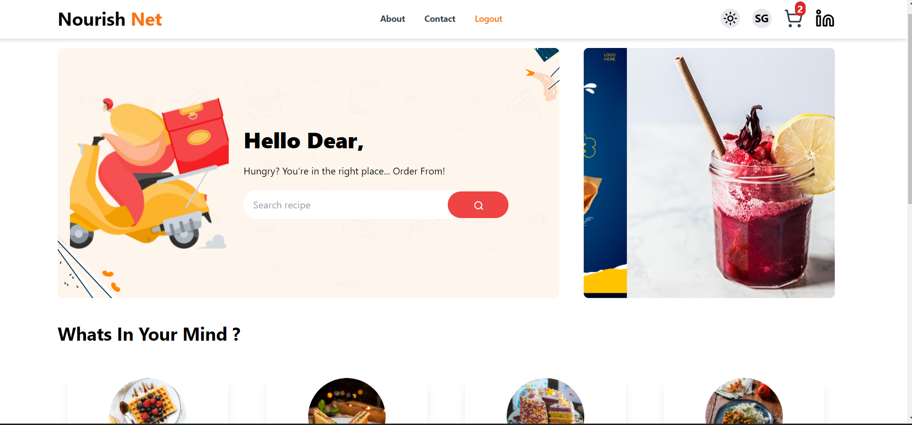
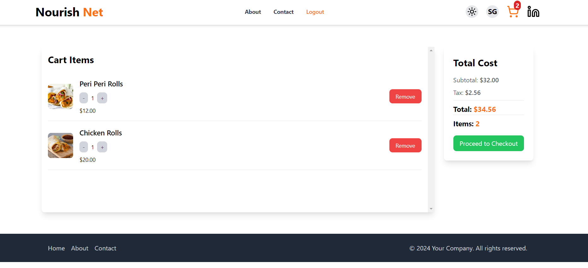

# NourishNet (https://nourish-net-theta.vercel.app/)

NourishNet is a web application for online grocery shopping. It allows users to browse products, add them to cart, and proceed to checkout.

## Table of Contents

- [Features](#features)
- [Technologies Used](#technologies-used)
- [Installation](#installation)
- [Usage](#usage)
- [Screenshots](#screenshots)
- [Contributing](#contributing)
- [License](#license)
- [Acknowledgements](#acknowledgements)

## Features

- Browse and search for grocery products.
- Add products to cart and adjust quantities.
- User authentication and profile management.
- Checkout process with payment integration.

## Technologies Used

- React.js for frontend development.
- Redux for state management.
- Firebase for user authentication and Firestore database.
- Tailwind CSS for responsive and modern styling.
- Lucide icons for graphical elements.

## Installation

1. Clone the repository.
2. Navigate to the project directory.
3. Install dependencies with `npm install`.
4. Configure Firebase credentials.
5. Start the development server with `npm start`.

## Usage

- Visit the deployed application or start the development server locally.
- Browse products, add them to your cart, and proceed to checkout.
- Login or register to manage your profile and view order history.

## Screenshots

## Contributing

Contributions are welcome! Please submit bug reports, feature requests, or pull requests through GitHub issues and pull requests.

## License

This project is licensed under the MIT License - see the [LICENSE](/LICENSE) file for details.

## Acknowledgements

- Icons provided by Lucide.
- Inspired by e-commerce platforms and modern web development practices.
